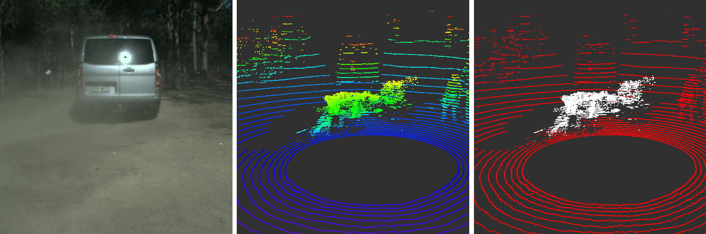

# Airborne Particle Classification in LiDAR Point Clouds Using Deep Learning

This repository contains the code for our paper on learning-based particle detection in LiDAR pointclouds.

**Authors:** Leo Stanislas, [Julian Nubert](https://juliannubert.com/), Daniel Dugas, Julia Nitsch, Niko Sünderhauf, Roland Siegwart, Cesar Cadena, Thierry Peynot



For more information on the code refer to the READMEs in the subdirectories.
The two proposed and compared methods are subdivided into the directories [./point_classification](./point_classification) and [./voxel_classification](./voxel_classification)

If you find this work useful, or use it for your research, please consider citing the corresponding work:
```
@inproceedings{stanislas2021airborne,
  title={Airborne particle classification in LiDAR point clouds using deep learning},
  author={Stanislas, Leo and Nubert, Julian and Dugas, Daniel and Nitsch, Julia and S{\"u}nderhauf, Niko and Siegwart, Roland and Cadena, Cesar and Peynot, Thierry},
  booktitle={Field and Service Robotics},
  volume={16},
  pages={395--410},
  year={2021},
  organization={Springer}
}
```
