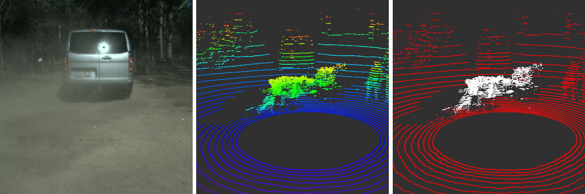
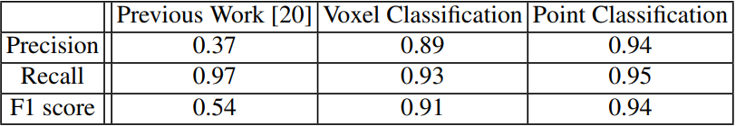
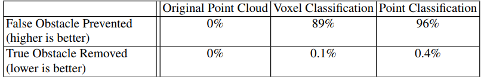

<h2>Abstract</h2>
LiDAR sensors have been very popular in robotics due to their ability to provide accurate range measurements and their robustness to lighting conditions. However,  their sensitivity to airborne particles such as dust or fog can lead to perception algorithm failures (e.g. the detection of false obstacles by field robots). In this work, we address this problem by proposing methods to classify airborne particles in LiDAR data. We propose and compare two deep learning approaches, the first is based on voxel-wise classification, while the second is based on point-wise classification. We also study the impact of different combinations of input features extracted from LiDAR data, including the use of multi-echo returns as a classification feature. We evaluate the performance of the proposed methods on a realistic dataset with the presence of fog and dust particles in outdoor scenes. We achieve an F1 score of 94\% for the classification of airborne particles in LiDAR point clouds, thereby significantly outperforming the state-of-the-art. We show the practical significance of this work on two real-world use cases: a relative pose estimation task using point cloud matching, and an obstacle detection task.
 
 

 
Left: Image of an experimental scene with dust behind a car. Middle: LiDAR point cloud with dust corruption (colored by height). Right: Predicted particles (white) and non-particles (red)
  

<h2> Classification Performance </h2>

 
Comparison of classification results between our approaches with the best configurations of input features and the state of the art.
  

<h2> Used Cases </h2>

<h3>Point Cloud Matching Task</h3>

<h3>Obstacle Detection Task</h3>

 
Occupancy grids (occupied: black cells, free: light grey cells, unobserved: dark grey) and predicted point cloud with particles in white and non-particlesin red. Left:Original point cloud. Right: Point cloud with predicted particles removed.
  

 
Performance of our classification approaches on the obstacle detection task
  

