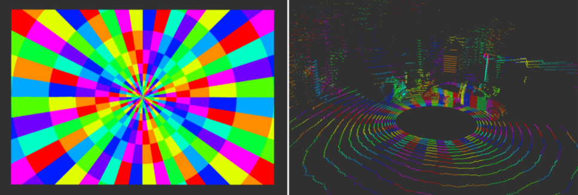

# Labeling 

We developed an algorithm to semi-automatically label large amounts of LiDAR data. We make use of statically recorded scenes allowing a background subtraction approach. We propose a robust and precise labeling technique for scans being disturbed,
consisting of two steps: 
* Labeling of all non static objects by performing background subtraction against a scan only containing static objects. 
* Manually introducing spatial boundaries (e.g. planes) to filter out wrongly labeled objects.

The idea of the whole appraoch is that it's easier to manually remove wrongly labeled objects compared to manually define all objects which need to be labeled. 

## Subtraction

For the background subtraction of the intermediate scans we are not using regular 3D occupancy grids but process each vertical ring of the LiDAR scan separately. For each of them we are filling an angular radial-logarithmic occupancy grid and subtract the associated one of the static scan. This grid contains 900 horizontal angle increments and 20 radial logarithmic increments, see the following Figure for an illustration. 

Each cell is considered as occupied if a LiDAR point falls within its 2D space boundary. By choosing a logarithmic scale along the range dimension, grid entries are enlarging significantly with increasing range accounting for diminishing density, imprecision and noise in the far field which is very advantageous for this labeling task. After subtracting the static of the dynamic grid, their difference reveals the cells that have been occupied by dynamic LiDAR points.

The code for this is given in "1_labeling_apply_occupancy_grid.py"

## Removal

Finally, we manually correct mislabeled elements in the dataset which is more effective than manually labeling the entire dataset.

For this the file "2_labeling_use_predefined_spaces.py" needs to be used. Here you can define your spcaces using geometrical relations (e.g. planes, spheres, squares, ...).

Our labeled dataset contains 16247 (27 minutes) labeled scans including dust and fog particles across 19 different outdoor scenes. To evaluate our approaches, we use 9 scenes as a training set, 2 scenes as a validation set, and the remaining 8 scenes as a test set. We make sure the scenes are sufficiently different configurations from training to testing to prevent overfitting. All results are computed on the entire test set unless specified otherwise.
